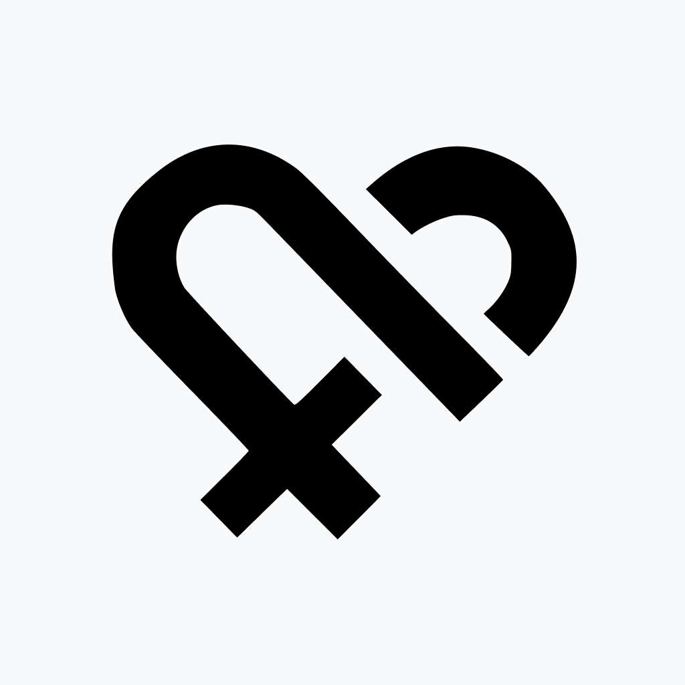

# Heally - Health and Fitness Mobile Application
>  More health. More connected.

## Developed by:
- Rafael Soares
- Diogo Gonçalves

---

## About the Project

Heally is a mobile application dedicated to health and fitness, developed since September 2023. Its goal is to provide users with a comprehensive and personalized experience to improve their physical and mental well-being.

---

## Key Features

### Body Measurements Report and Recording

- Record and monitor your body measurements.
- Add a photo each week/month to visualize progress.

### Calorie Counter

- Record food intake based on our food API.
- Receive suggestions to achieve your health goals.

### Workout Routine Assistant

- Create and record your workout routines.
- Record weights/repetitions for analysis of progress over time.
- Easily share the workout summary on social media.

### Workout Plan Creator

- Create a personalized workout plan based on specific data.

### Hydration Monitor

- Set daily water intake goals based on various variables.
- Record various types of beverages.

### Intermittent Fasting

- Receive warnings about the dangers of intermittent fasting for those engaging in physical activity.

### Mental Health

- Access articles and resources related to mental health.

### Cardiology Monitor

- Record systolic pressure, diastolic pressure, and heart rate by date and time.

### Medication Reminder

- Receive notifications to take your medication.

### Menstrual Cycle Monitoring (Premium)

- Get a comprehensive view of your menstrual cycle.

---

## Mission, Vision, and Values

### Mission

Our mission is to use technology to promote healthy mental and physical habits and lifestyle.

### Vision

We aim to reach and impact more lives, prioritizing the well-being of our users as our main goal.

### Values

- We commit to being competent with all those we assist.
- We give more than we receive, prioritizing the well-being of our users.
- We contribute to innovation in our market.

---

**Note:** This project was initiated in September 2023 by Rafael Soares and Diogo Gonçalves.

---

*Thank you for choosing Heally to take care of your health and well-being!* 🌟
